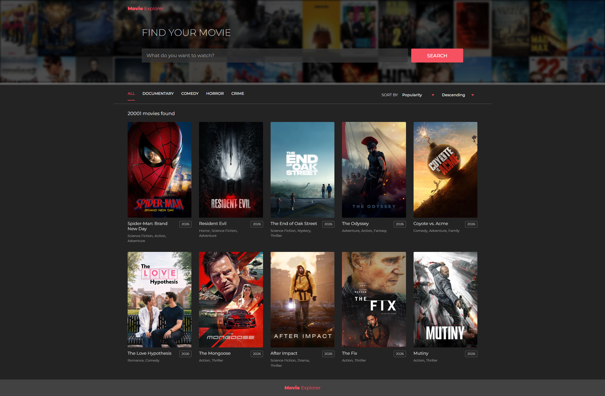
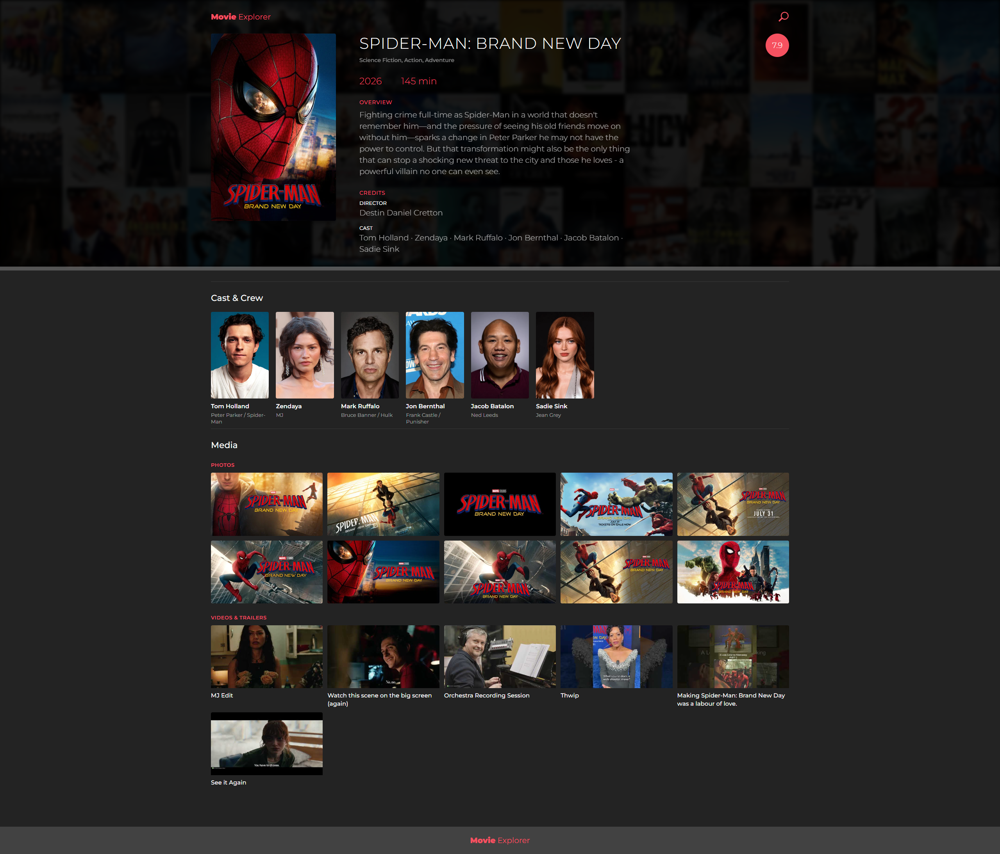

# Movie Explorer

Movie Explorer is a full-stack movie search and browsing application. The
frontend presents searchable, filterable movie results and movie details; the
backend provides the application API and integrates with The Movie Database
(TMDB) for movie data and poster images.

## Screenshots

### Home



### Movie Details



## Architecture

This repository is an npm workspace monorepo orchestrated by Turborepo:

- `apps/web` - React 19, TypeScript, Vite, React Router, React Hook Form, and
  SCSS frontend.
- `apps/api` - NestJS, TypeScript, class-validator, and Swagger/OpenAPI API.
  TMDB access is isolated in `src/integrations/tmdb`.
- `packages/contracts` - shared public TypeScript contracts used by both apps.

The frontend calls the API through a small service boundary. The API maps TMDB
responses to application-owned contracts rather than exposing TMDB response
shapes directly. Frontend tests use Vitest and React Testing Library; backend
unit and e2e tests use Jest.

## Prerequisites

- Node.js 24 or newer
- npm 11.6.2 or newer
- A TMDB API read access token for local API development

The repository declares npm 11.6.2 as its package manager. Install the
matching version when reproducibility with CI is important.

## Installation and environment

Install all workspace dependencies from the repository root:

```bash
npm install
```

Copy the safe examples and provide local values:

```powershell
Copy-Item apps/api/.env.example apps/api/.env
Copy-Item apps/web/.env.example apps/web/.env
```

Set `TMDB_ACCESS_TOKEN` in `apps/api/.env`. The remaining API variables have
safe defaults and can be changed for a different TMDB endpoint, image size,
language, or region. `VITE_API_BASE_URL` controls the frontend API origin and
defaults to `http://localhost:4000`. Never commit `.env` files or real tokens.

## Development

Run the complete local application from the repository root:

```bash
npm run dev
```

The API listens on `http://localhost:4000`; Vite serves the frontend on its
default port, `http://localhost:5173`. The API's generated OpenAPI UI is
available at `http://localhost:4000/api-docs`.

Run only one workspace when needed:

```bash
npm run dev --workspace @movie-explorer/web
npm run start:dev --workspace @movie-explorer/api
```

## Verification commands

Root scripts run the matching workspace tasks through Turborepo:

```bash
npm run lint
npm run typecheck
npm test
npm run build
npm run test:e2e
```

The frontend uses `vitest run`; the backend uses Jest. The API e2e command
builds the required workspaces and runs the NestJS e2e suite with a mocked
provider, so it does not require TMDB credentials.

For narrower checks, use workspace scripts such as
`npm run lint:typescript --workspace @movie-explorer/web` or
`npm test --workspace @movie-explorer/api`.

## Production builds

Create production artifacts with:

```bash
npm run build
```

This builds the API into `apps/api/dist`, the frontend into `apps/web/dist`,
and emits contract declarations. Provide the TMDB environment variables to the
API runtime, then start the built API with:

```bash
npm run start:prod --workspace @movie-explorer/api
```

The frontend artifact can be served by a static host or previewed locally with
`npm run preview --workspace @movie-explorer/web`.

## Continuous integration

GitHub Actions runs on pushes to `main` and pull requests. The CI workflow
uses Node.js 24, `npm ci`, and the root Turborepo scripts for linting,
typechecking, unit tests, production builds, and API e2e tests. It uses the
lockfile for npm caching and has read-only repository permissions.
